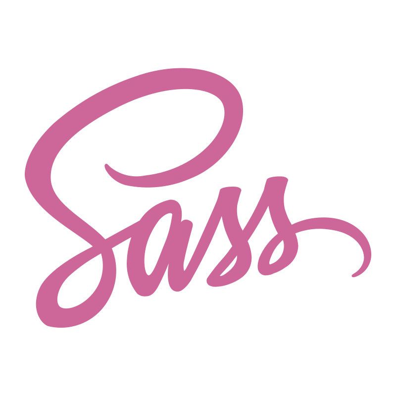
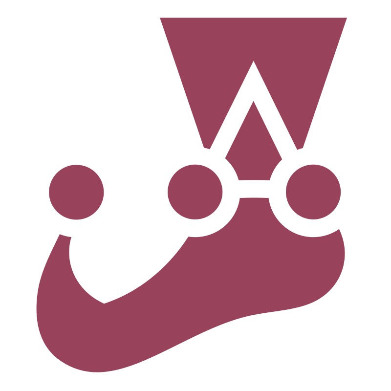

# 👋 Olá, eu sou José Hermes

Desenvolvedor Fullstack focado em aplicações web, APIs REST e automações.

## O que utilizo:

  
  
  
  
  
  
  
  
  
  
  

**Também trabalho com:** Python • APIs REST • MVC • Autenticação JWT • Testes Automatizados • IAs (Gemini, ChatGPT e Claude)

## 📊 GitHub Stats

## 📫 Contato

[LinkedIn](https://www.linkedin.com/in/jose-hermes-dev/) • [GitHub](https://github.com/Neto13k)